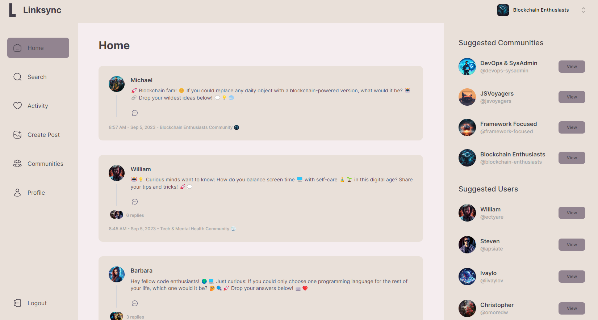

# [Linksync](https://linksync-bay.vercel.app/) - Software engineers' social media

Linksync: A dedicated platform for software engineers 💻 to come together to discuss 🗣️, collaborate 👩‍💻👨‍💻, and network 🌐 around various topics in the tech world 🌍. Built with love ❤️ for the coding community, this platform aims to be the premier destination 📍 for tech talk! 🚀🔧🖥️.

# Features

## 🔐 **Secure Registration**
- Register using a secure, encrypted password mechanism.
- Option to sign in using Gmail or GitHub for a seamless experience.

## 🚀 **Onboarding Process**
- Set up your personal details such as name and username.
- Upload a profile photo to make your profile stand out.
- Craft a bio that highlights your interests and expertise.

## 🌐 **Create Community**
- Start your own niche community or join existing ones.
- Manage members and their roles within the community.

## 📝 **Create Posts**
- Share your thoughts with the community.

## 💬 **Create Comments**
- Engage in meaningful discussions on posts.
- Reply to other comments to create nested discussion threads.

## 🗑️ **Delete Posts**
- Remove any of your posts with a simple click.

## ✏️ **Edit Profile**
- Keep your profile up-to-date with the latest information.
- Change profile pictures, update bios, or modify other personal details.

## Getting Started

To assist you in diving directly into Linksync and testing its features, I've provided a test account for you to use without the need to register.

**Username:** `ectyare`  
**Password:** `2t8LK31%2&`

🚫 **Please note:**
- Do not use this account for personal posts or any sensitive data.
- Since this is a shared test account, any data you input may be visible to others.

### Steps to Access:

1. Navigate to the [Linksync login page](https://linksync-bay.vercel.app/sign-in).
2. Enter the provided username and password.
3. Explore and test the platform's features!

⚠️ Remember to logout once you're done to maintain the integrity of the test account.
